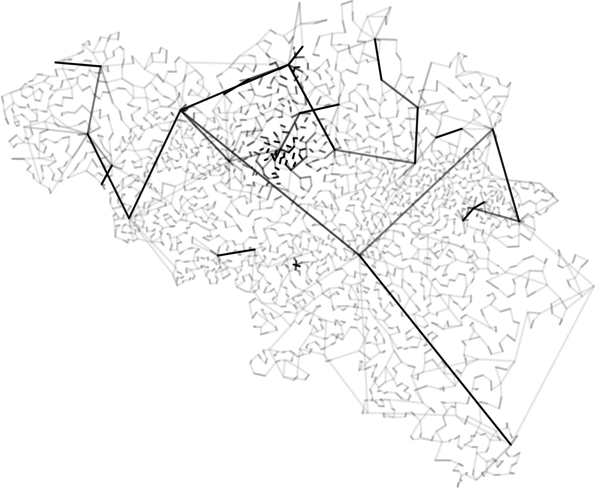
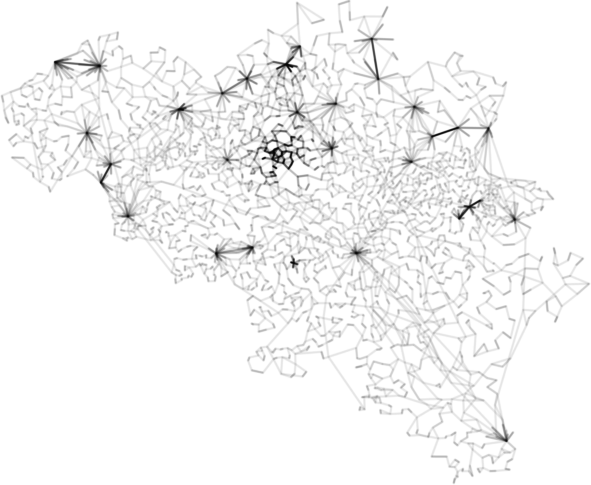

# Stochastic improvement of deterministic algorithms for MV-TSP

Nowadays, there are a lot of deterministic algorithms finding bounded solutions to many-visits travelling salesman problems. Obviously, the lower the worst-case bound, the higher the complexity of the algorithm.

Therefore, we asked ourselves, _"Can stochastic algorithms improve significantly such deterministic solutions ?"_.

Short answer : **YES**.

Using the [Metropolis-Hastings algorithm](https://en.wikipedia.org/wiki/Metropolis%E2%80%93Hastings_algorithm), we managed to improve low complexity algorithm ([Nearest neighbour algorithm](https://en.wikipedia.org/wiki/Nearest_neighbour_algorithm)) solutions to the point of catching up with high complexity algorithm ([Christofides algorithm](https://en.wikipedia.org/wiki/Christofides_algorithm)) solutions.

As an instance of TSP, we have used the `2734` belgian cities and have added a multiplicity layer according to the demographic density.

	
	
	 
	Nearest neighbour algorithm solution (40420 km) and its stochastic improvement (27941 km).

## Language

* Computations have been made using the [MATLAB](https://mathworks.com/products/matlab.html) language in its **R2019a** version and some of its toolboxes.

## Authors

* **François Rozet** - [francois-rozet](https://github.com/francois-rozet)
* **Pedro José Correia Duarte** - [pedrojcd](https://github.com/pedrojcd)

## References

* [_Méthodes de Monte-Carlo par chaînes de Markov_](https://github.com/francois-rozet/math0488-1/) - **François Rozet**
